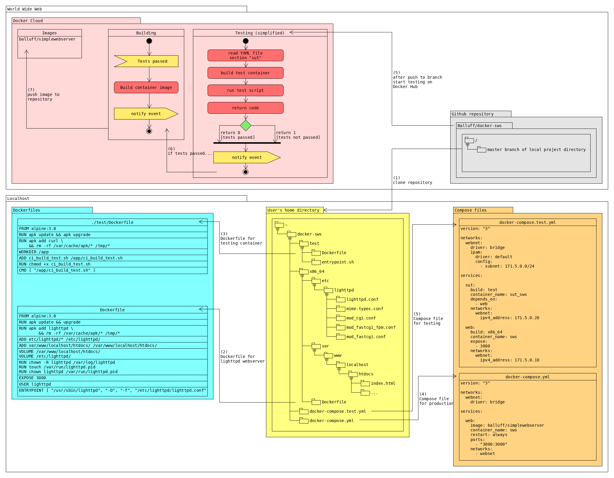

# About

On this project we provide a simple but powerful webserver in a small and fast container image.

Also this project is to test the integration between Github and the [docker cloud](https://cloud.docker.com) for automated building and testing after git push.

## References

- Official [Alpine Docker Hub image](https://hub.docker.com/_/alpine/) as base
- Webserver [lighttpd](http://www.lighttpd.net/)
- Configuration files and build instructions for lighttpd in a Docker container from [spujadas/lighttpd-docker](https://github.com/spujadas/lighttpd-docker)
- Tutorial [How To Configure a Continuous Integration Testing Environment with Docker and Docker Compose on Ubuntu 14.04](https://www.digitalocean.com/community/tutorials/how-to-configure-a-continuous-integration-testing-environment-with-docker-and-docker-compose-on-ubuntu-14-04)

## Project sources

If you want to change the webserver configuration download the files directly from our [Github project site](https://github.com/Balluff/docker-sws) and change it.

## Container usage

Pull this container via `docker pull balluff/simplewebserver` and run it with the following minimal parameter set:

```sh
$ docker run --name web_test -d --rm -p 8080:3000 balluff/simplewebserver
```

You can then open your webbrowser and access the simple web site via `http://localhost:8080`.

## Container mount binds

After mount bind the directory into the container:

```sh
$ docker run --name web_test -d --rm -v CONFIGS_FROM_HOST:/etc/lighttpd/ -p 8080:3000 balluff/simplewebserver
```

Other HTML context can also mounted to the container:

```sh
$ docker run --name web_test -d --rm -v HTML_FROM_HOST:/var/www/localhost/htdocs/ -p 8080:3000 balluff/simplewebserver
```

## Docker compose

### Run service

You can also use Docker Compose to start the web service. For this download the compose file from the Github project site or copy-paste the following content into a new `docker-compose.yml`.

```docker
version: "3"

networks:
  webnet:
    driver: bridge

services:

  web:
    image: balluff/simplewebserver
    ports:
      - "8080:3000"
    volumes:
      - ./webserver/www/:/var/www/localhost/htdocs/
    networks:
      - webnet
```

Start the service with `docker-compose up -d`.

### Build service

You can also rebuild the container image for your own usage. To do this there are 2 possible options:
- Edit the `docker-compose.yml` file and set the build instruction instead of the image from Docker Hub:

  ```docker
  ...
  services:

    web:
      build: .
  ...
  ```

  You can then build the image and run the service via `docker-compose up -d --build`.

- Follow the next chapter if you don't want to change the compose file.

## Continous Integration Tests

For testing use the `docker-compose.test.yml` file. This file references to `Dockerfile.test` which builds a new Alpine based Linux container and runs a script on execution.
The scripts validates via `curl` if the given `index.html` file and its content is available.
If not the test fails.
Use Docker Compose to build and run the tests:

```sh
docker-compose -f docker-compose.test.yml build
docker-compose -f docker-compose.test.yml up -d
```

Have a look inside the docker log for the test result:

```sh
docker logs -f docker-testing_sut_1
```

## Architecture

The following picture shows the project file structure, architecture and the Github account linking to Docker Hub/Cloud.


## Continous Integration Pipeline with Docker Cloud

To optimize the CI pipeline for the container image builds you can use various build providers. Because Docker provides us the [Docker Cloud](https://cloud.docker.com) we can use it to automatically test and create container images.

tbd